# Festivo — Campus Club & Event Management Platform

> **9th DRMC International Tech Carnival 2026 — AI Web Development Contest Submission**  
> **Theme:** Smart Club Operations  
> **License:** [MIT License](LICENSE)

**Live site:** [club-management-rust.vercel.app](https://club-management-rust.vercel.app/)

---

## 1. Project Overview

Traditionally, campus clubs and student organizations rely on fragmented third-party Google Forms, spreadsheets, and manual messaging to coordinate festival registrations. This leads to broken user experiences, unverified gate admissions, double-booked venues, and lost participant history.

**Festivo** is an enterprise-grade campus event and club operations platform engineered to eliminate registration friction. Built with modern web standards and backed by Supabase PostgreSQL with strict Row Level Security (RLS), Festivo orchestrates the complete lifecycle:

$$\text{Organization} \longrightarrow \text{Fest} \longrightarrow \text{Event} \longrightarrow \text{Team / Registration} \longrightarrow \text{QR Gate Pass} \longrightarrow \text{Attendance \& Passport XP}$$

---

## 2. Key Features Breakdown (Judged Rubric)

### A. Fest & Event Directory

- **Multi-Club & Multi-Fest Architecture:** Distinct club portfolios (e.g., DRMC IT Club, Apex Technology Society, Lumina Photography, Nexus Business) hosting multiple concurrent and upcoming fests.
- **Dynamic Fest Details & Schedule:** Chronological timeline of ceremonies, exhibition pavilions, and contest stages with venue coordinates.
- **Rich Event Cards:** Category badges, participation mode (`individual` vs `team`), capacity meters, and deadline countdowns.
- **Instant Search & Multi-Tag Filtering:** Filter by category, technical track, delivery format (in-person vs virtual), and search by keywords.
- **Comprehensive Event Pages:** Full eligibility criteria, rulebooks, venue capacities, registration modes, and live registration status.

### B. Smart Registration System

- **Atomic Concurrency Control:** High-concurrency registration handled via PostgreSQL advisory locks and transactional RPCs—guaranteeing zero overfill under simultaneous traffic spikes.
- **FIFO Waitlist Automation:** Capacity-capped events automatically transition entrants to an ordered waitlist. When an entrant cancels, the system automatically checks eligibility and promotes the first candidate with real-time in-app notifications.
- **Team Roster Management:** Captains create draft teams, issue secure email-bound invitation tokens, collect affirmative rulebook acceptance, and submit locked rosters.
- **Server-Enforced Schedule Conflicts:** Prevents participant double-booking across overlapping events; allows explicit acknowledgement for adjacent non-conflicting time slots.
- **Participant Workspace:** Full management dashboard (`/my-registrations`), team management (`/my-teams`), and chronological schedule with `.ics` calendar export (`/my-schedule`).

### C. Organizer Management & Operations

- **Role-Aware Dashboards:** Granular role boundaries (`organizer`, `check_in_staff`, `participant`, `visitor`).
- **Live Analytics Hub (`/analytics`):** Real-time metrics on confirmed entries, unique participants, waitlist volume, and attendance rate with date/fest filters.
- **Participant Roster & Safe CSV Export:** Searchable multi-column table with CSV export protected against formula injection (`=`, `+`, `-`, `@`, `\t`).
- **Help Desk Queue (`/help-desk`):** Multi-priority ticketing queue where participants submit queries and organizers assign staff to resolve issues.
- **Operations & Post-Fest Reporting (`/operations`):** Automated operational reports sharing unified metrics with optional AI analysis.

### D. Smart Operations & Bonus Solutions

- **Per-Person Digital QR Event Passes (`/my-passes`):** Cryptographically opaque passes issued to every confirmed attendee (including every team member).
- **Gate Check-In Workspace (`/check-in`):** Camera scanner and manual registration-ID lookup scoped to authorized gate staff; idempotent scans with live metrics.
- **Realtime Live Fest Mode:** Live event monitor updating in real time via Supabase Realtime, backed by a 30-second refetch polling fallback.
- **Private Club Passport & XP Gamification (`/passport`):** Automated attendance rewards (20 XP per event check-in), organizer workshop verifications, and milestone badges.
- **"Ask Festivo" AI Campus Assistant (`/assistant`):** Context-aware chatbot powered by Google Gemini with deep links, sign-in security on personal data, and a deterministic offline rule-based fallback.

---

## 3. Tech Stack

| Layer | Technologies |
| :--- | :--- |
| **Frontend Framework** | React 19, TypeScript (Strict Mode), Vite 8 |
| **Styling & Design System** | Tailwind CSS v4, Custom CSS Variables, Lucide Icons |
| **State & Data Fetching** | TanStack Query v5, React Router v7 |
| **Forms & Validation** | React Hook Form, Zod v3 |
| **Backend & Database** | Supabase (PostgreSQL 15, Row Level Security, PL/pgSQL RPCs) |
| **Realtime & Storage** | Supabase Realtime, Supabase Storage |
| **Serverless Functions** | Deno Edge Functions (`festivo-assistant`, `organizer-copilot`) |
| **AI Integration** | Google Gemini (`gemini-flash-lite-latest`) via OpenAI-compatible endpoint |
| **Testing & Verification** | Node.js Test Runners, Chrome DevTools Protocol (CDP) Browser Walkthrough |

---

## 4. Safe Demo Credentials

The platform includes pre-seeded fictional demo accounts ready for evaluation:

| Role | Email | Password | Access / Scope |
| :--- | :--- | :--- | :--- |
| **Master Admin** | `admin@festivo.org` | `Password123!` | All clubs, governance, full access |
| **Tech Organizer** | `organizer.tech@festivo.org` | `Password123!` | Apex Technology Society (`/organizer`, `/analytics`, `/operations`) |
| **Photo Organizer** | `organizer.photo@festivo.org` | `Password123!` | Lumina Photography Club (`/organizer`, `/analytics`) |
| **Business Organizer** | `organizer.business@festivo.org` | `Password123!` | Nexus Business & Beacon Social League |
| **Science Organizer** | `organizer.science@festivo.org` | `Password123!` | Vertex Science Society |
| **Gate Check-In Staff** | `staff@festivo.org` | `Password123!` | Gate Staff Scanner (`/check-in`) across all campus fests |
| **Participant (Captain)** | `demo.participant@festivo.org` | `Password123!` | Captain of CyberPulse AI, 100+ XP, QR passes, verified attendance |
| **Participant (Member)** | `participant1@festivo.org` | `Password123!` | Confirmed registrations, team pass, help desk ticket |
| **Participant (Member)** | `participant2@festivo.org` | `Password123!` | Confirmed registrations, team pass, assigned support ticket |
| **Participant (Waitlisted)**| `participant3@festivo.org` | `Password123!` | Waitlisted captain, new support ticket |

---

## 5. Local Setup Instructions

### Prerequisites

- Node.js `20.x` or higher
- npm `10.x` or higher
- Git

### Installation Steps

1. **Clone the repository:**
   ```bash
   git clone https://github.com/tanjim041/Club_Management.git
   cd Club_Management
   ```

2. **Install dependencies:**
   ```bash
   npm install
   ```

3. **Configure Environment Variables:**
   Copy `.env.example` to `.env`:
   ```bash
   cp .env.example .env
   ```
   Provide your Supabase URL and Publishable Key in `.env`:
   ```env
   VITE_SUPABASE_URL=https://your-project.supabase.co
   VITE_SUPABASE_PUBLISHABLE_KEY=your-anon-key
   ```

4. **Run the Development Server:**
   ```bash
   npm run dev
   ```
   Open [http://localhost:5173](http://localhost:5173) in your browser.

5. **Run Verification & Quality Checks:**
   ```bash
   npm run typecheck    # TypeScript compiler check (0 errors)
   npm run lint         # ESLint check (0 errors)
   npm run build        # Production bundle build
   ```

---

## 6. Supabase Backend Setup

Festivo relies on checked-in SQL migrations for schema and security policies.

```bash
# Link project
npx supabase link --project-ref <your-project-ref>

# Apply migrations
npx supabase db push

# Seed idempotent demo data
node scripts/seed_demo_data.mjs

# Check the saved demo timeline, public availability, and authenticated views
node scripts/verify_demo_timeline.mjs

# Deploy Edge Functions
node scripts/deploy_ai_functions.mjs
```

The demo seed requires `SUPABASE_URL`, `SUPABASE_SECRET_KEY`, and
`SUPABASE_ACCESS_TOKEN` in `.env`; verification also requires
`SUPABASE_PUBLISHABLE_KEY`. Keep these server credentials out of the client
bundle. The repeatable seed reconciles only deterministic fictional fixtures;
it checks that the real 9th DRMC International Tech Carnival 2026 row and its
official events are unchanged. Existing non-demo registrations are not reset.

The five upcoming fictional fests run November 12-14, 16-18, 20-22, 25-27,
and 28-30, 2026 in `Asia/Dhaka`. The separate club showcase fixtures extend
into December 1-4 and 10-12. Closed registration examples close on October 8;
their events still run in November. Completed 2025 showcase rows and the
September 27-29, 2026 Beacon archive are explicitly labeled `[Historical
Demo]`, not advertised as upcoming events. On October 9, Live Fest correctly
has no fictional event happening now.

### Server-Side Edge Function Secrets

Configure the AI provider in Supabase secrets (never in client variables):
```bash
npx supabase secrets set AI_PROVIDER=openai_compatible
npx supabase secrets set AI_BASE_URL=https://generativelanguage.googleapis.com/v1beta/openai
npx supabase secrets set AI_MODEL=gemini-flash-lite-latest
npx supabase secrets set AI_API_KEY=<your-google-ai-studio-key>
```
*Note: If no API key is provided, the platform automatically switches to its deterministic rule-based calculation fallback.*

---

## 7. Master Test Suite & Verification Results

A comprehensive automated verification suite exercises all core backend and frontend workflows:

```bash
node scripts/run_part11_test_suite.mjs
```

### Execution Results: **8 / 8 Suites Passed (100%)**

| Test Suite | Coverage & Scenarios Verified | Result | Duration |
| :--- | :--- | :---: | :---: |
| **1. Registration & FIFO Promotion** | Race conditions, RLS table protection, cross-user cancellations, FIFO waitlist promotion, in-app notices | **PASS** | 10.5s |
| **2. Concurrency & Team Races** | Simultaneous team submissions, capacity limits held, atomic roster captures | **PASS** | 11.1s |
| **3. Team Rosters & Conflicts** | Unguessable invitation tokens, roster locks, schedule conflict blocking, .ics exports | **PASS** | 16.5s |
| **4. QR Passes & Gate Check-In** | Opaque QR tokens, staff check-in RPC, repeat scan idempotency, revoked pass rejection | **PASS** | 22.9s |
| **5. Engagement & Passport** | Scoped announcements, notification read receipts, help desk tickets, attendance XP, post-fest reports | **PASS** | 16.9s |
| **6. AI Integration & Resilience** | Gemini replies with deep links, schedule isolation, injection resistance, offline fallback | **PASS** | 70.0s |
| **7. CSV Sanitization & Matcher** | Spreadsheet formula injection neutralization (`=`, `+`, `-`, `@`), deterministic event ranking | **PASS** | 0.2s |
| **8. Ask Festivo Browser Flow** | Desktop & mobile chatbot discoverability, suggestion chips, sign-in requirement on personal queries | **PASS** | 25.6s |

---

## 8. Multi-Device Screenshots Showcase

### Visitor Experience

| Desktop Landing Page (`/`) | Tablet Fest Detail (`/fests/...`) | Mobile Club Profile (`/clubs/...`) |
| :---: | :---: | :---: |
| 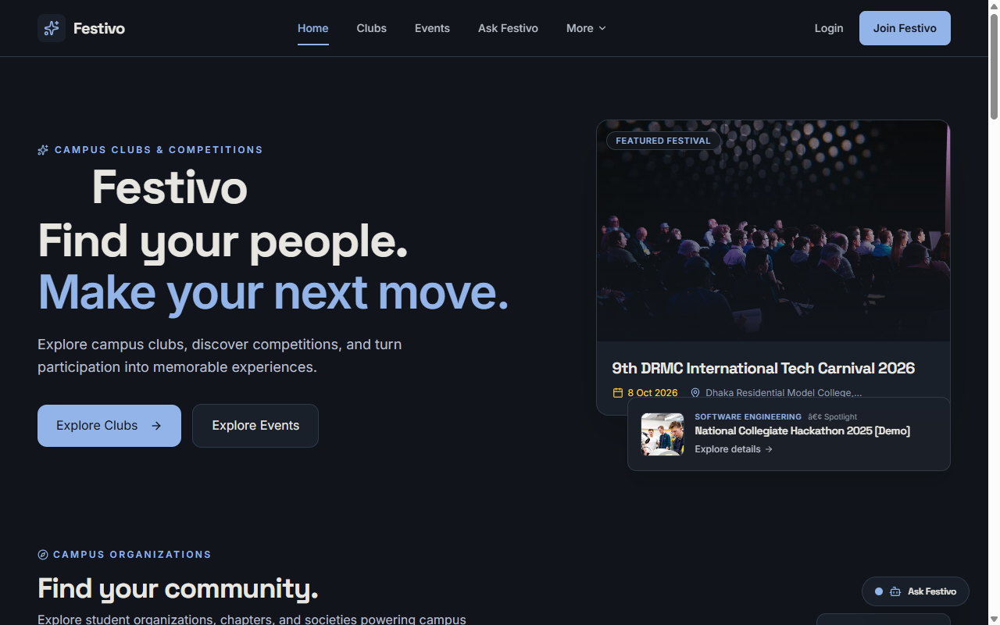 | 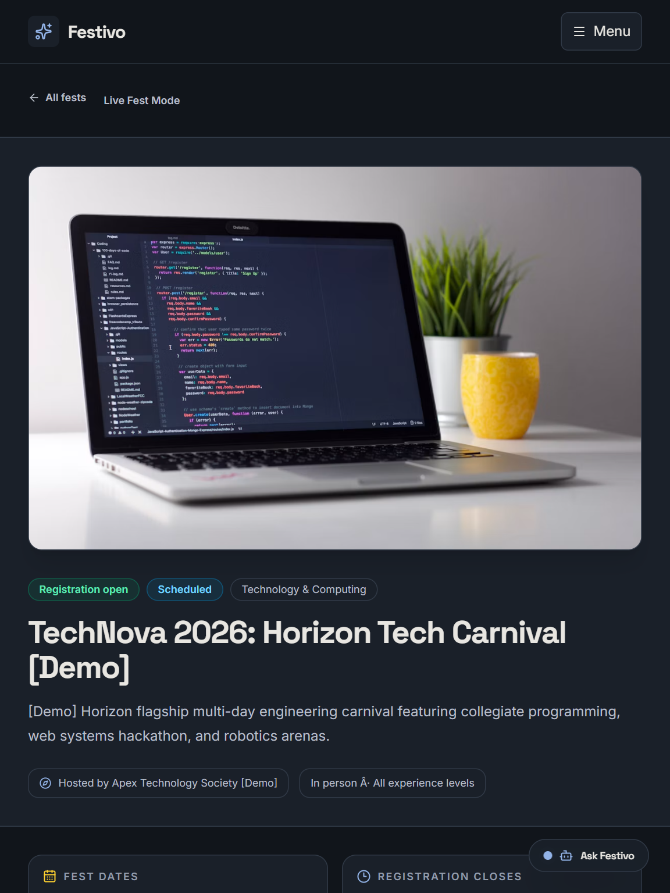 | 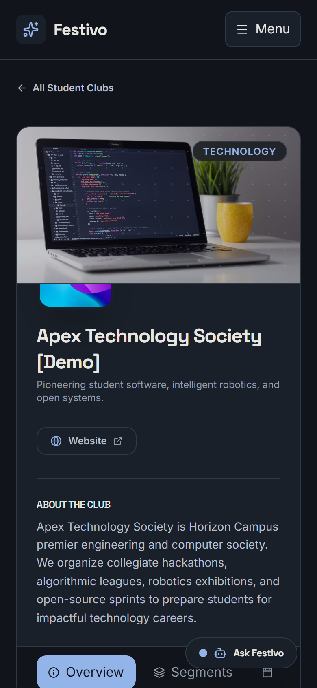 |

### Participant Experience

| Desktop Digital Passes (`/my-passes`) | Tablet Club Passport (`/passport`) | Mobile Team Management (`/my-teams`) |
| :---: | :---: | :---: |
| 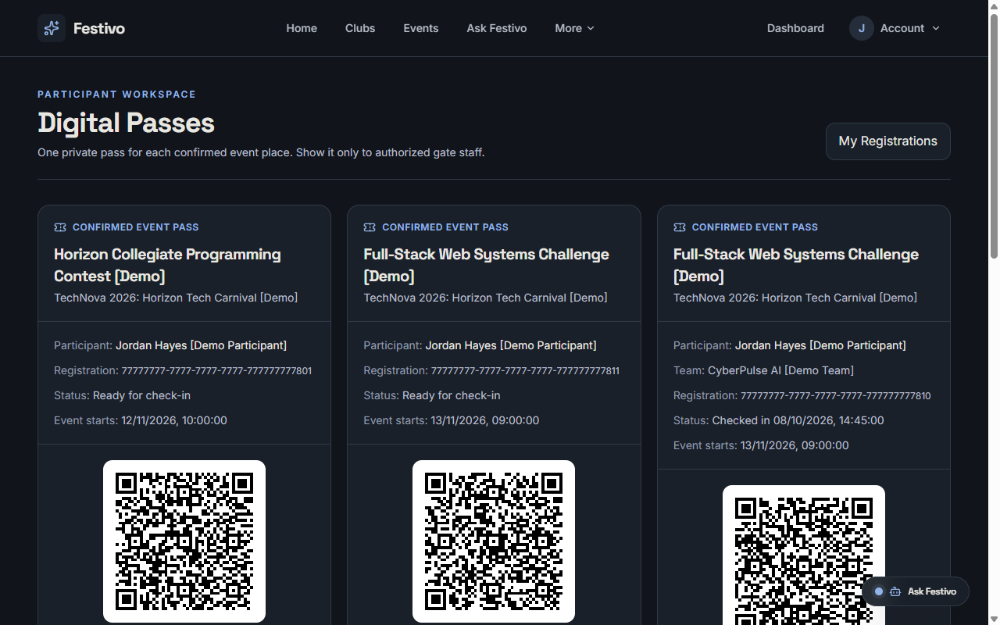 | 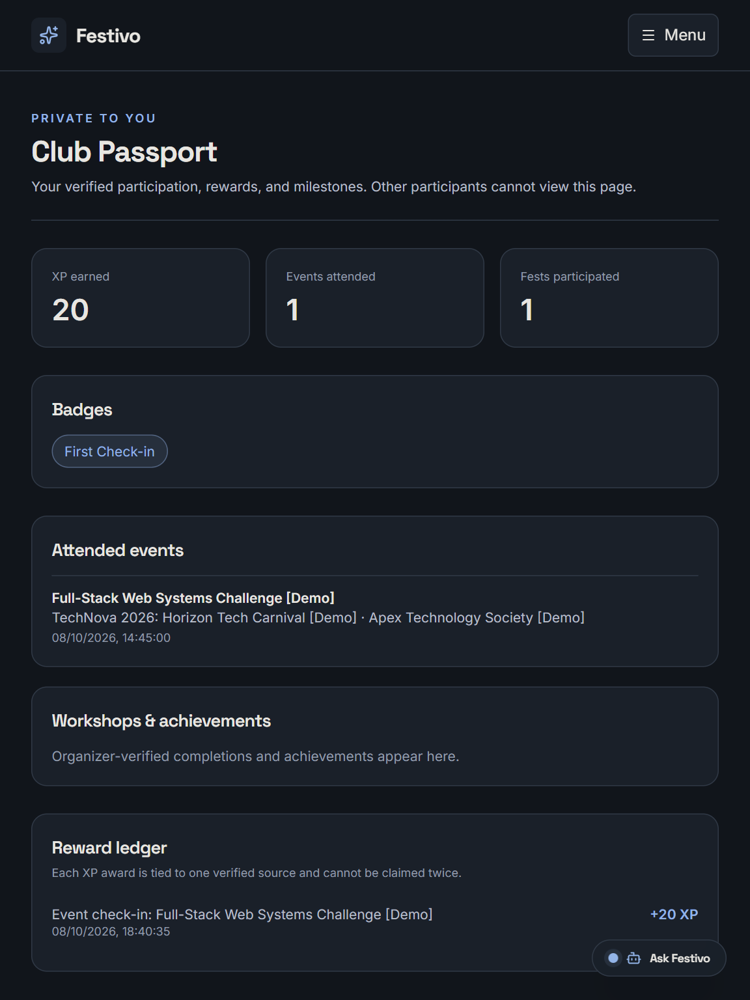 | 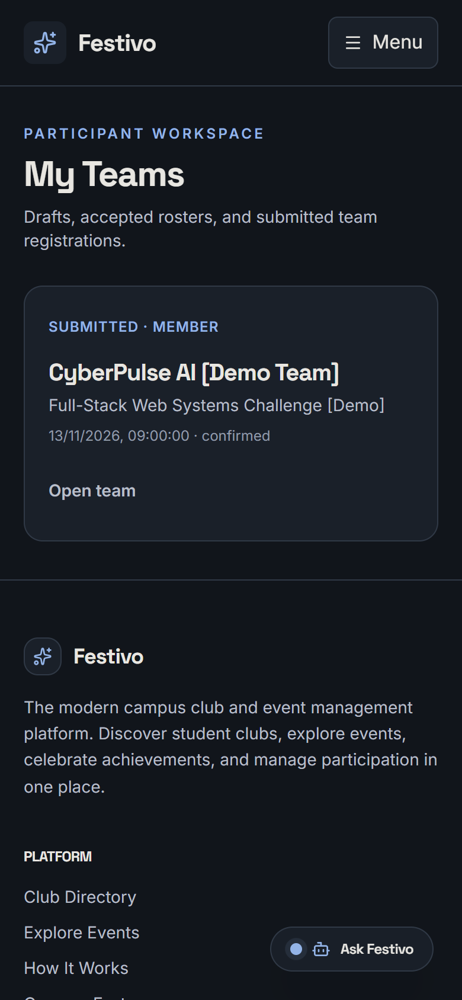 |

### Organizer & Gate Staff Experience

| Organizer Analytics (`/analytics`) | Operations Hub (`/operations`) | Gate Staff Check-In (`/check-in`) |
| :---: | :---: | :---: |
| 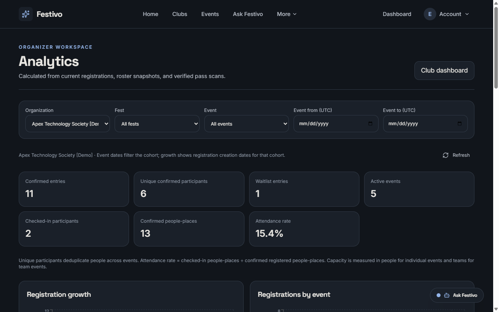 | 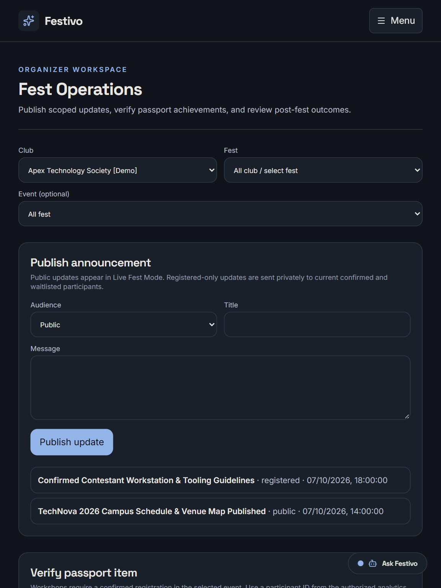 | 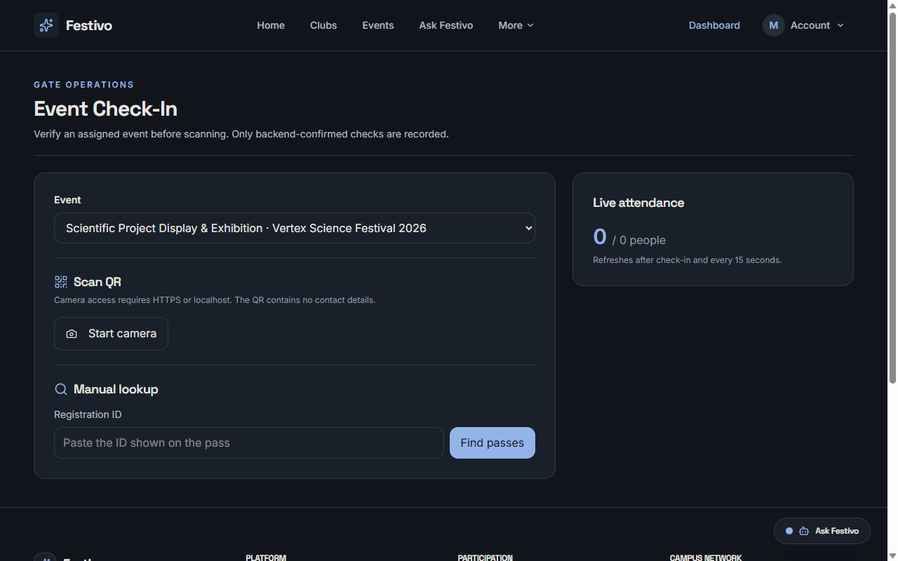 |

### "Ask Festivo" AI Campus Assistant

| Personal Query Sign-In Callout | Model Reply with Deep Links | Offline Rule-Based Fallback Mode |
| :---: | :---: | :---: |
| 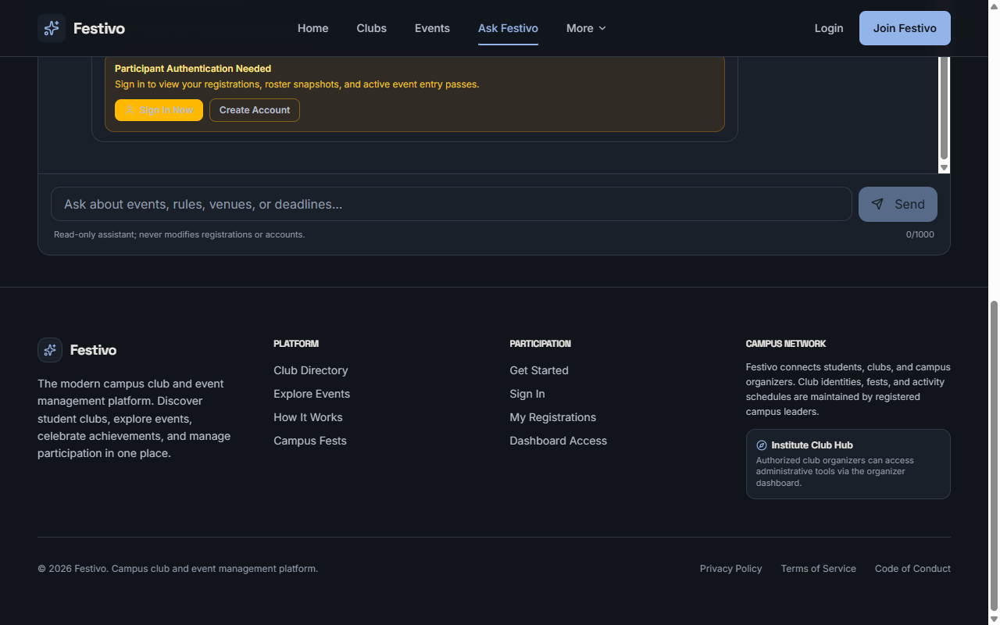 | 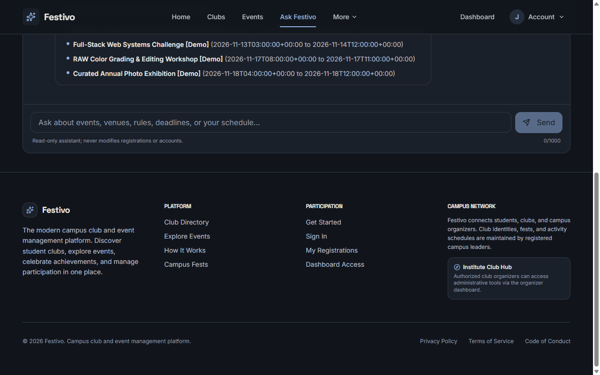 | 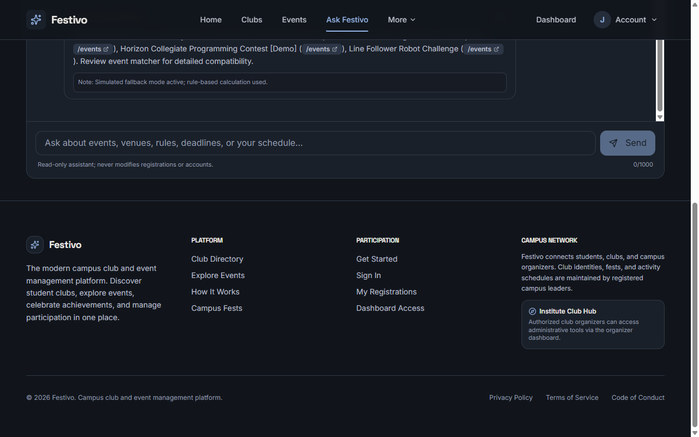 |

---

## 9. Third-Party Services & Disclosures

- **Supabase Cloud:** PostgreSQL database, authentication, storage, real-time replication, and Edge Functions.
- **Google AI Studio / Gemini API:** Used for `festivo-assistant` natural language explanations and `organizer-copilot` metric summaries.
- **Unsplash CDN:** Curated, high-resolution student club and campus photography assets.
- **AI Tooling Disclosure:** Developed in pair programming with **Google DeepMind Antigravity**. Production models tested: `gemini-flash-lite-latest`.

---

## 10. Known Limitations & Production Hardening

1. **Camera QR Scanning:** The browser HTML5 camera scanner requires `localhost` or an HTTPS secure origin per web browser security standards (`navigator.mediaDevices.getUserMedia`). On insecure HTTP, gate staff can use the instant **Manual Lookup** input.
2. **Payment Processing:** Financial transactions are intentionally bypassed for this collegiate contest release. All events are configured for zero-fee admissions or on-campus desk confirmations.
3. **In-App Notifications:** Realtime in-app notifications are delivered within the web application interface; native web push notifications require service-worker APNs/FCM credentials.

---

## 11. Deployment Status & Verification

- **Local Verification URL:** `http://localhost:5173` (all visitor, participant, organizer, and gate check-in workflows verified).
- **Backend Edge Functions:** Deployed to Supabase project `ylmjekpzaxnitthrwncs` (`festivo-assistant`, `organizer-copilot`).
- **Public Frontend Deployment:** [Live on Vercel](https://club-management-rust.vercel.app/). The production deployment requires `VITE_SUPABASE_URL` and `VITE_SUPABASE_PUBLISHABLE_KEY` in Vercel's Production environment variables.

---

## 12. License

This project is licensed under the terms of the **MIT License**. See the [LICENSE](LICENSE) file for complete terms.  
Copyright (c) 2026 MD. TANJIMUL ISLAM.
